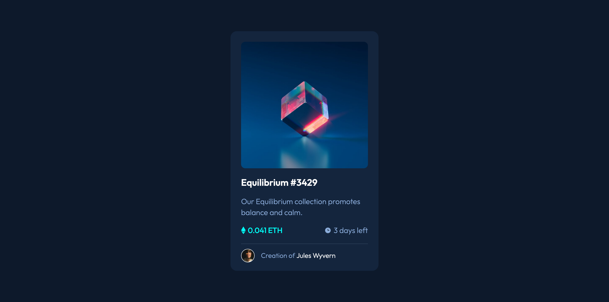

# Frontend Mentor - NFT preview card component solution

This is a solution to the [NFT preview card component challenge on Frontend Mentor](https://www.frontendmentor.io/challenges/nft-preview-card-component-SbdUL_w0U). Frontend Mentor challenges help you improve your coding skills by building realistic projects.

## Table of contents

- [Overview](#overview)
  - [Screenshot](#screenshot)
  - [Links](#links)
- [My process](#my-process)
  - [Built with](#built-with)
- [Author](#author)

## Overview

### Screenshot

### Links

- Solution URL: [solution](https://github.com/nguyensylvie/NFT-preview-card)
- Live Site URL: [live site](https://nguyensylvie.github.io/NFT-preview-card)

## My process

### Built with

- HTML
- SASS
- Flexbox
- Grid

## Author

- Frontend Mentor - [@nguyensylvie](https://www.frontendmentor.io/profile/nguyensylvie)
